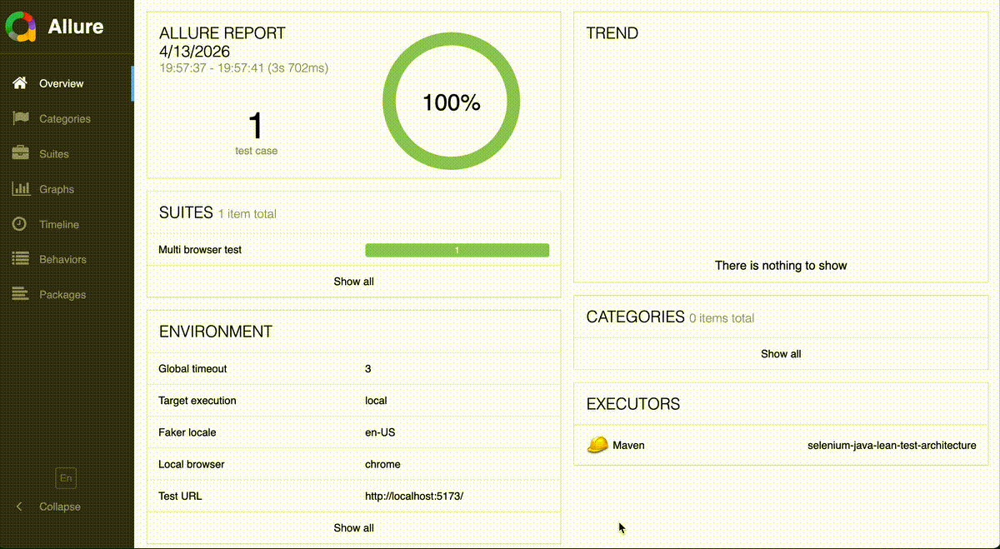
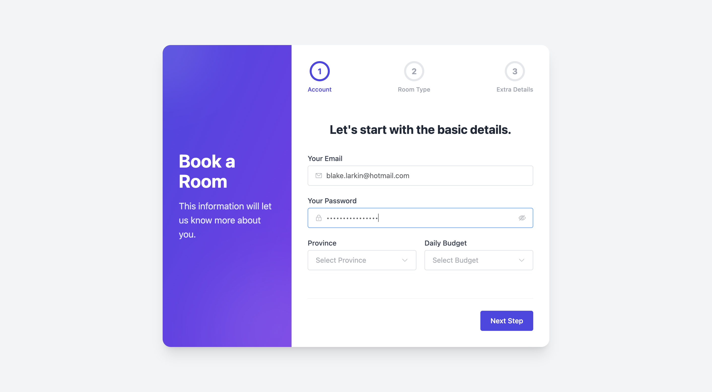
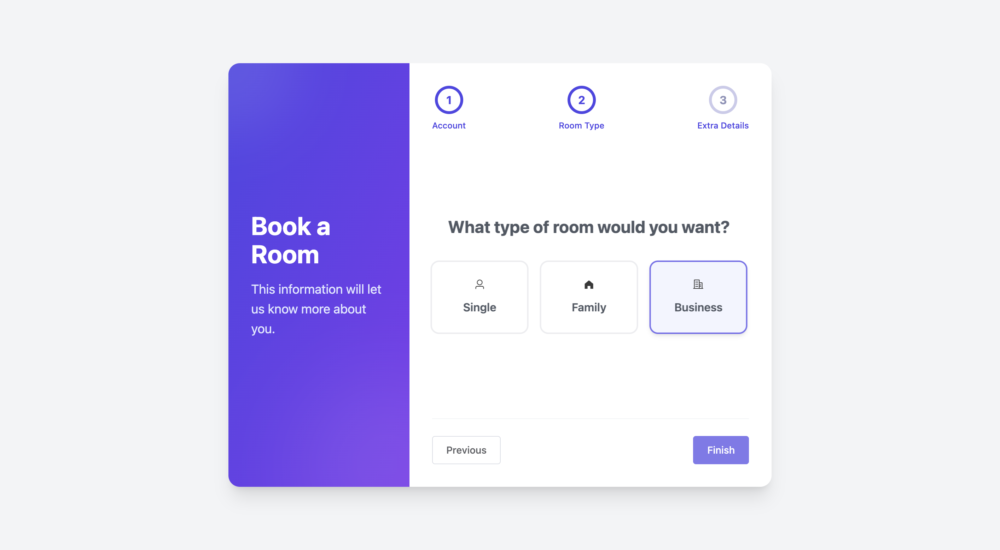
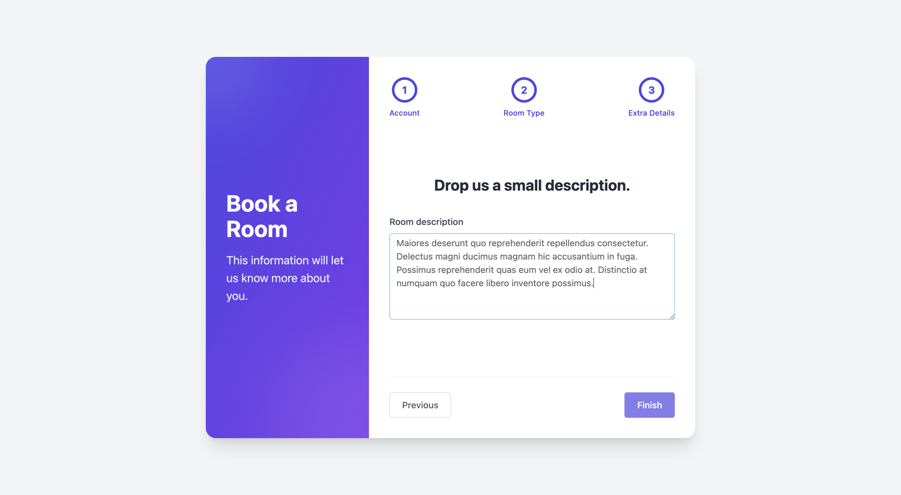

# Selenium Java Test Framework

一个基于 `Selenium + TestNG + Maven + Allure` 的轻量级 Web UI 自动化测试框架，内置页面对象模型（POM）、多执行目标（本地 / Selenium Grid / Testcontainers）以及操作过程截图记录。

## 特性

- 基于 Java 21 和 Maven，开箱即用
- 使用 TestNG Suite 管理测试执行
- 支持三种执行目标：`local`、`selenium-grid`、`testcontainers`
- 集成 Allure 报告（包含环境信息）
- 自动记录 Selenium 操作步骤并附加截图

## 目录结构

```text
.
├── assets/
│   └── project-execution-screenshots/           # README 执行截图
│       ├── allure_report.gif
│       ├── step-01.png
│       ├── step-02.png
│       └── step-03.png
├── grid/                                         # Selenium Grid 相关配置
│   ├── config.toml
│   └── docker-compose.yml
├── src/
│   ├── main/
│   │   ├── java/com/larry/
│   │   │   ├── assertion/                        # UI 断言工具类
│   │   │   │   └── UiAssertions.java
│   │   │   ├── config/                           # 配置读取（Owner）
│   │   │   │   ├── Configuration.java
│   │   │   │   └── ConfigurationManager.java
│   │   │   ├── data/                             # 测试数据
│   │   │   │   ├── changeless/                  # 静态数据
│   │   │   │   │   └── BrowserData.java
│   │   │   │   ├── dynamic/                     # 动态数据工厂
│   │   │   │   │   └── BookingDataFactory.java
│   │   │   │   └── provider/                    # 数据提供者（JSON/CSV/YAML）
│   │   │   │       └── TestDataProvider.java
│   │   │   ├── driver/                           # Driver 工厂与管理
│   │   │   │   ├── BrowserFactory.java
│   │   │   │   ├── DriverManager.java
│   │   │   │   └── TargetFactory.java
│   │   │   ├── enums/                            # 枚举类型
│   │   │   │   ├── RoomType.java
│   │   │   │   └── Target.java
│   │   │   ├── exceptions/                       # 自定义异常
│   │   │   │   └── HeadlessNotSupportedException.java
│   │   │   ├── model/                            # 数据模型
│   │   │   │   ├── Booking.java
│   │   │   │   ├── DashboardConfig.java
│   │   │   │   ├── DashboardTestData.java
│   │   │   │   └── LoginTestData.java
│   │   │   ├── page/                             # Page Object
│   │   │   │   ├── booking/                     # 预订流程页面
│   │   │   │   │   ├── common/                  # 公共组件
│   │   │   │   │   │   └── NavigationPage.java
│   │   │   │   │   ├── AccountPage.java
│   │   │   │   │   ├── DashboardPage.java
│   │   │   │   │   ├── DetailPage.java
│   │   │   │   │   └── RoomPage.java
│   │   │   │   ├── guru99/                      # Guru99 银行页面
│   │   │   │   │   └── LoginPage.java
│   │   │   │   └── AbstractPageObject.java      # Page Object 基类
│   │   │   ├── report/                           # Allure 报告相关
│   │   │   │   ├── AllureFailureAttachment.java # 失败时附加信息（源码/日志/网络错误）
│   │   │   │   ├── AllureManager.java
│   │   │   │   ├── AllureTestLifecycleListener.java
│   │   │   │   └── SeleniumActionListener.java  # Selenium 动作监听器
│   │   │   ├── retry/                            # 测试重试机制
│   │   │   │   ├── RetryAnalyzer.java
│   │   │   │   └── RetryContext.java
│   │   │   └── wait/                             # 等待工具类
│   │   │       └── Waits.java
│   │   └── resources/
│   │       └── log4j2.properties
│   └── test/
│       ├── java/com/larry/
│       │   ├── test/                             # 测试类
│       │   │   ├── BookRoomWebTest.java          # 预订房间测试
│       │   │   ├── DashboardTest.java            # 数据仪表盘测试
│       │   │   └── LoginTest.java                # 登录测试
│       │   └── BaseWeb.java                      # 测试基类（启动/销毁驱动）
│       └── resources/
│           ├── META-INF/services/
│           │   └── io.qameta.allure.listener.TestLifecycleListener
│           ├── suites/                           # TestNG Suite 文件
│           │   ├── local.xml
│           │   └── selenium-grid.xml
│           ├── testdata/                         # 测试数据文件
│           │   ├── booking.json                  # 预订测试数据（JSON）
│           │   ├── dashboard_test_data.json      # 仪表盘测试数据
│           │   └── login_test_data.json          # 登录测试数据
│           ├── allure.properties
│           ├── general.properties                # 通用配置
│           └── selenium-grid.properties          # Grid 配置
├── .gitignore
├── pom.xml
└── README.MD
```

## 架构设计

### 1. Page Object 继承关系树

```
                    AbstractPageObject
                           │
           ┌───────────────┴───────────────┐
           │                               │
           ▼                               ▼
    DashboardPage                  NavigationPage
    (仪表盘页面)                      (导航按钮基类)
                                           │
                    ┌──────────────────────┼──────────────────────┐
                    │                      │                      │
                    ▼                      ▼                      ▼
              AccountPage              RoomPage              DetailPage
              (账户页面)              (房型页面)              (详情页面)
           ┌─────────────────┐
           │  - 邮箱输入      │
           │  - 密码输入      │
           │  - 省份选择      │
           │  - 预算选择      │
           └─────────────────┘
```

### 2. 层级结构图

| 层级 | 类名 | 图标 | 功能 | 子类 |
|:----:|------|:----:|------|------|
| **L0 (根)** | `AbstractPageObject` | 🏠 | PageFactory 初始化 | 所有 Page |
| **L1 (能力层)** | `NavigationPage` | 🧭 | 导航按钮 (Next/Finish) | Account/Room/Detail |
| **L1 (独立)** | `DashboardPage` | 📊 | 数据仪表盘 | 无 |
| **L2 (页面层)** | `AccountPage` | 👤 | 账户信息填写 | 无 |
| **L2 (页面层)** | `RoomPage` | 🛏️ | 房型选择 | 无 |
| **L2 (页面层)** | `DetailPage` | 📝 | 预订详情确认 | 无 |

### 3. 预订流程图

```
┌─────────────┐     点击 Next      ┌─────────────┐     点击 Next      ┌─────────────┐
│             │ ─────────────────▶ │             │ ─────────────────▶ │             │
│ AccountPage │                    │  RoomPage   │                    │ DetailPage  │
│   账户页面   │                    │   房型页面   │                    │   详情页面   │
│             │ ◀───────────────── │             │                    │             │
└─────────────┘    点击 Previous   └─────────────┘                    └─────────────┘
       │                                                                  │
       │                         三个页面都继承                          │
       │                         NavigationPage                          │
       │                            (共享导航按钮)                        │
       │                                                                  │
       └───────────────────────────┬────────────────────────────────────┘
                                   │
                                   ▼
                            ┌─────────────┐
                            │NavigationPage│
                            │   导航基类    │
                            └─────────────┘
                                   │
                                   ▼
                            ┌─────────────┐
                            │AbstractPage │
                            │   Object    │
                            │  PageFactory│
                            └─────────────┘
```

### 4. 数据流图

```
                    ┌─────────────────────────────────────────┐
                    │           AbstractPageObject            │
                    │  ┌───────────────────────────────────┐  │
                    │  │ protected AbstractPageObject() {  │  │
                    │  │   initElements(                    │  │
                    │  │     AjaxElementLocatorFactory,    │  │
                    │  │     this                          │  │
                    │  │   );                              │  │
                    │  │ }                                 │  │
                    │  └───────────────────────────────────┘  │
                    └─────────────────────┬───────────────────┘
                                          │
            ┌─────────────────────────────┼─────────────────────────────┐
            │                             │                             │
            ▼                             ▼                             ▼
   ┌────────────────┐          ┌──────────────────┐          ┌────────────────┐
   │  DashboardPage │          │  NavigationPage  │          │  其他独立页面   │
   │  (直接继承)     │          │  (导航按钮基类)   │          │                │
   │                │          │                  │          │                │
   │  - 统计数据     │          │  - Next 按钮    │          │                │
   │  - 预订记录表格  │          │  - Previous 按钮│          │                │
   │  - 图表         │          │  - Finish 按钮  │          │                │
   │  ❌ 无导航按钮  │          │                  │          │                │
   └────────────────┘          └────────┬─────────┘          └────────────────┘
                                         │
                   ┌─────────────────────┼─────────────────────┐
                   │                     │                     │
                   ▼                     ▼                     ▼
           ┌─────────────┐       ┌─────────────┐       ┌─────────────┐
           │ AccountPage │       │  RoomPage   │       │ DetailPage  │
           │   账户页面   │       │   房型页面   │       │   详情页面   │
           │             │       │             │       │             │
           │ ✅ 有导航   │       │ ✅ 有导航   │       │ ✅ 有导航   │
           │  ─────────▶ │       │  ─────────▶ │       │  ─────────▶ │
           │  Next 按钮  │       │  Next 按钮  │       │  Finish 按钮│
           └─────────────┘       └─────────────┘       └─────────────┘
```

### 5. Page 类对比表

| Page 类 | 继承的类 | 拥有的能力 | 使用场景 |
|---------|---------|-----------|---------|
| `AbstractPageObject` | 无 | PageFactory 初始化 | 所有 Page 的基类 |
| `NavigationPage` | `AbstractPageObject` | + 导航按钮 (Next/Previous/Finish) | 流程步骤页面的基类 |
| `DashboardPage` | `AbstractPageObject` | PageFactory 初始化 | 独立仪表盘页面 |
| `AccountPage` | `NavigationPage` | + 导航按钮 + PageFactory | 预订流程：账户填写 |
| `RoomPage` | `NavigationPage` | + 导航按钮 + PageFactory | 预订流程：房型选择 |
| `DetailPage` | `NavigationPage` | + 导航按钮 + PageFactory | 预订流程：详情确认 |

### 6. 继承设计说明

```
┌─────────────────────────────────────────────────────────────────┐
│                    为什么分两层继承？                               │
├─────────────────────────────────────────────────────────────────┤
│                                                                 │
│  场景 1: 仪表盘页面 (DashboardPage)                              │
│  ┌─────────────────────────────────────────────────────────┐   │
│  │  ❌ 没有 Next/Previous/Finish 按钮                       │   │
│  │  ❌ 不是预订流程的一部分                                   │   │
│  │  ✅ 只需要 PageFactory 初始化                             │   │
│  │  ➡️ 直接继承 AbstractPageObject                          │   │
│  └─────────────────────────────────────────────────────────┘   │
│                                                                 │
│  场景 2: 预订流程页面 (Account/Room/Detail)                     │
│  ┌─────────────────────────────────────────────────────────┐   │
│  │  ✅ 有 Next/Previous/Finish 按钮                         │   │
│  │  ✅ 是预订流程的步骤                                      │   │
│  │  ✅ 需要 PageFactory + 导航能力                           │   │
│  │  ➡️ 继承 NavigationPage (它又继承 AbstractPageObject)    │   │
│  └─────────────────────────────────────────────────────────┘   │
│                                                                 │
└─────────────────────────────────────────────────────────────────┘
```

## 环境要求

- JDK `21`
- Maven `3.9+`
- Chrome / Firefox / Edge / Safari（按本地执行目标选择）
- Docker（使用 Selenium Grid 或 Testcontainers 时需要）
- 被测应用可访问（默认：`http://localhost:5173/`）

## 快速开始

### 1. 克隆项目

```bash
git clone https://github.com/zhenglarry007/selenium.git
cd selenium
```

### 2. 准备被测应用

默认配置在 `src/test/resources/general.properties`：

```properties
url.base = http://localhost:5173/
```

请先确保该地址可以打开并可正常交互。

### 3. 执行本地测试

```bash
mvn test -Pweb-execution -Dsuite=local
```

## 运行方式

### 方式 A：本地浏览器（local）

默认 `target=local`，浏览器由 `general.properties` 控制：

```properties
target = local
browser = chrome
headless = false
```

执行命令：

```bash
mvn test -Pweb-execution -Dsuite=local
```

可通过系统参数覆盖：

```bash
mvn test -Pweb-execution -Dsuite=local -Dbrowser=firefox -Dheadless=true
```

### 方式 B：Selenium Grid（selenium-grid）

1. 启动 Grid：

```bash
cd grid
docker compose up -d
cd ..
```

2. 执行 Grid Suite：

```bash
mvn test -Pweb-execution -Dsuite=selenium-grid -Dtarget=selenium-grid
```

默认 Grid 地址来源于 `src/test/resources/selenium-grid.properties`：

```properties
grid.url = localhost
grid.port = 4444
```

### 方式 C：Testcontainers（testcontainers）

```bash
mvn test -Pweb-execution -Dsuite=local -Dtarget=testcontainers -Dbrowser=chrome
```

> 说明：`suite=local` 指 TestNG 用例集合；`target=testcontainers` 指执行基础设施。两者可以组合使用。

## 测试报告与截图

### 生成并查看 Allure 报告

```bash
mvn allure:serve
```

或先生成静态报告：

```bash
mvn allure:report
```

报告结果目录：

- `target/allure-results`
- `target/site/allure-maven-plugin`

### Selenium 操作过程记录

框架已自动记录常见 Selenium 动作（如 `open/click/sendKeys`），并在 Allure Step 中附加截图。

### 项目执行截图

下方为真实执行过程截图示例（来自本项目自动化运行）：







## 常用命令速查

```bash
# 本地执行（默认 Chrome）
mvn test -Pweb-execution -Dsuite=local

# 本地无头执行
mvn test -Pweb-execution -Dsuite=local -Dheadless=true

# Grid 执行
mvn test -Pweb-execution -Dsuite=selenium-grid -Dtarget=selenium-grid

# 查看 Allure 报告
mvn allure:serve
```

## 配置说明

配置优先级（高 -> 低）：

1. `-D` 系统参数
2. `src/test/resources/general.properties`
3. `src/test/resources/selenium-grid.properties`

核心配置项：

- `target`: `local | selenium-grid | testcontainers`
- `browser`: `chrome | firefox | edge | safari`
- `headless`: `true | false`
- `url.base`: 被测系统入口
- `timeout`: 全局等待超时（秒）

## 新增测试用例（建议）

1. 在 `src/main/java/com/larry/page` 新增页面对象方法。
2. 在 `src/test/java/com/larry/test` 新增 TestNG 测试类。
3. 在 `src/test/resources/suites/*.xml` 中注册测试类。
4. 执行 `mvn test -Pweb-execution -Dsuite=local` 验证。

## 常见问题

- 浏览器驱动报错：请确认本机浏览器版本与 Selenium 兼容，并确保浏览器可启动。
- `Connection refused`：通常是 `url.base` 未启动或 Grid 未启动。
- 无 Allure 报告：先执行测试，再运行 `mvn allure:serve`。
- 看不到截图：确认测试已执行且 `target/allure-results` 中有 Allure 结果文件。

## 许可证

本项目基于 MIT 协议（如需开源发布，建议在仓库根目录补充 `LICENSE` 文件）。
